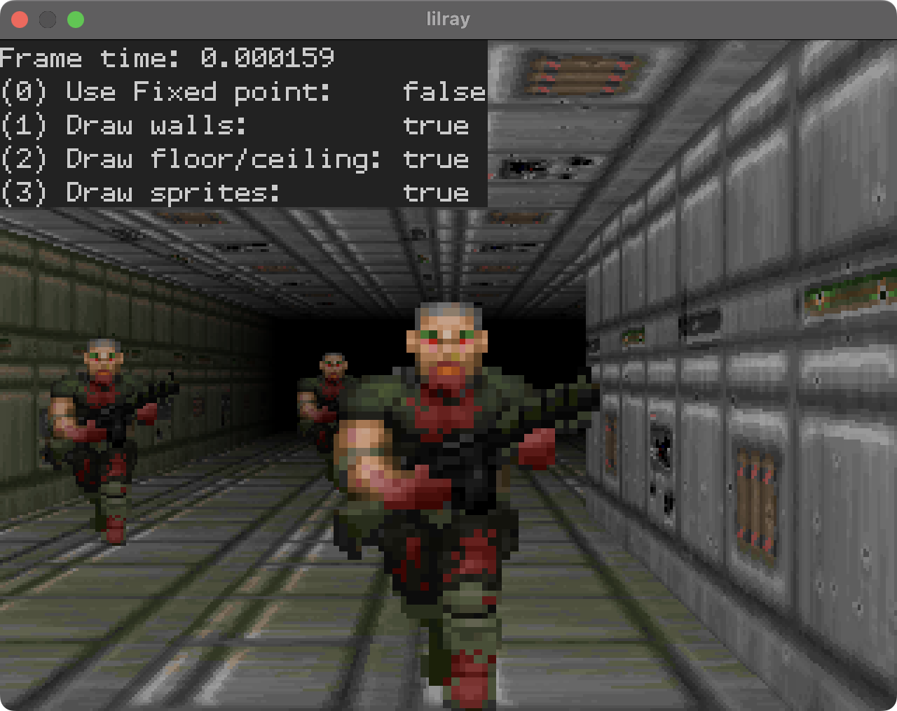

# lilray

A basic raycasting "engine" implemented in shoddy C++ with a C wrapper so it can be exposed to other languages, including JavaScript through WASM.

[Try it in your browser](https://marioslab.io/dump/lilray/)

## Usage
If all you want is to include the library in your C/C++ project, copy `src/lilray.cpp` and `src/lilray.h` to your project and include them in your build. If you want to use the C API, also copy `src/lilray-c.cpp` and `src/lilray-c.h`.

See `src/main.cpp`, `src/main.c`, and `web/index.html` for basic usage.

## Requirements (Demos)
To compile the demo projects for the desktop you'll need:

* **Windows**
    * [Git for Windows](https://git-scm.com/download/win). Make sure its available on the command line via the system PATH.
    * [Visual Studio with C++ support](https://visualstudio.microsoft.com/vs/features/cplusplus/)
    * [CMake](https://cmake.org/download/). Make sure you add CMake to the system `PATH` during installation, so you can execute it from the command line
    * [Ninja](https://github.com/ninja-build/ninja/releases). Put the `ninja.exe` file somewhere and make sure it's available on the command line via your system `PATH`
* **Linux**
    * [GCC](https://gcc.gnu.org/), Git, and GDB. E.g. Ubuntu/Debian: `sudo apt install build-essential git gdb`
    * x11-dev library. On Ubuntu/Debian `sudo apt install libx11-dev`
    * [CMake](https://cmake.org/download/). On Ubuntu/Debian: `sudo apt install cmake`
	* [Ninja](https://github.com/ninja-build/ninja/releases). On Ubuntu/Debian: `sudo apt install ninja`
* **macOS**
    * [XCode](https://developer.apple.com/xcode/). Make sure to also install the [command line tools](https://mac.install.guide/commandlinetools/4.html)
    * [CMake](https://cmake.org/download/). E.g. via [Brew](https://brew.sh/) `brew install cmake`
    * [Ninja](https://github.com/ninja-build/ninja/releases), E.g. via Brew `brew install ninja`


To build and run the demo projects for and in your browser, you'll need [Emscripten](https://emscripten.org/), and a local HTTP server to serve build output. The easiest solution for serving local files is Python: `python3 -m http.server <directory>`.  You can then view the files in the browser at [http://localhost:8000](http://localhost:8000).

To build and run the project for and in DOS, you'll need to run the `dos/tools/download-dos-tools.sh` script. On Windows, run the script via Git Bash, which comes as part of Git for Windows. It will install [DJGPP](https://www.delorie.com/djgpp/), a GCC fork for DOS, a fork of [GDB](https://github.com/badlogic/gdb-7.1a-djgpp) capable of debugging DOS applications, and a fork of [DOSBox-x](https://github.com/badlogic/dosbox-x) to run the executables in, which fixes a few issues allowing for remote debugging.

Finally, if you want an IDE experience, install [Visual Studio Code](https://code.visualstudio.com/). After successful installation, install these extension for C/C++ development:

* [C/C++ Extension Pack](https://marketplace.visualstudio.com/items?itemName=ms-vscode.cpptools-extension-pack). Provides C/C++ debugging, CMake support, and bad intellisense.
* [clangd](https://marketplace.visualstudio.com/items?itemName=llvm-vs-code-extensions.vscode-clangd). Provides great intellisense.
* [Native Debug](https://marketplace.visualstudio.com/items?itemName=webfreak.debug). Needed for debugging the demos in DOSBox-x.


## Building and running the demos from the command line
### Desktop
To build for your operating system:
```
cmake -S . -B build -G Ninja -DCMAKE_BUILD_TYPE=Release
cmake --build build
```

The resulting executables for each little demo app can then be found in the `build/` directory. You can run them directly on your host system.

You can debug the resulting executables with [LLDB](https://lldb.llvm.org/) (Windows, macOS) or [GDB](https://www.sourceware.org/gdb/) (Linux) on the command line. For that to work, you need to configure the CMake build with `-DCMAKE_BUILD_TYPE=Debug`.

### Web
To build for the web:
```
cmake -DCMAKE_TOOLCHAIN_FILE=/path/to/emsdk/<version>/emscripten/cmake/Modules/Platform/Emscripten.cmake -S . -B build -G Ninja -DCMAKE_BUILD_TYPE=Release
cmake --build build
```

This will generate a `.js` and `.wasm` file for each `.html` file in the `web/` folder. To run the demo apps in the browser, serve the `build/` folder locally with a web server of your choice. The simplest option is Python's `http.server` module:

```
python3 -m http.server --directory build/
```

Then open `http://localhost:80000` in your browser.

A workflow for web development is to leave the web server running, rebuild the project on source code changes and refresh the demo page in the browser.

You can also [debug both the JavaScript and C code in the browser](https://developer.chrome.com/blog/wasm-debugging-2020/). For that to work, you need to configure the CMake build with `-DCMAKE_BUILD_TYPE=Debug`.

### DOS
To build for DOS, first run the `dos/tools/download-dos-tools.sh` script to download the requirements. On Windows, run the script via Git Bash, which comes with Git for Windows. On Linux, you have to install additional dependencies via your package manager of choice. The script will tell you which.

Once the requirements are installed, build executables for DOS via:

```
cmake -DCMAKE_TOOLCHAIN_FILE=./dos/tools/toolchain-djgpp.cmake -S . -B build -G Ninja -DCMAKE_BUILD_TYPE=Release
cmake --build build
```

The resulting executables for each little demo app can then be found in the build/ directory. You can run them via DOSBox-x which was downloaded by the `download-dos-tools.sh` script like this:

```
./dos/tools/dosbox-x/dosbox-x -fastlaunch -exit -conf ./dos/dosbox-x.conf build/<executable-file.exe>
```

You can also debug the executables running in DOSBox-x. For that to work, you need to integrate the [GDB stub](https://sourceware.org/gdb/onlinedocs/gdb/Remote-Stub.html) that is found in `dos/gdbstub.h` like this:

```c
#define GDB_IMPLEMENTATION
#include "gdbstub.h"
int main(void) {
    gdb_start();
    ... setup code ...
    do {
        ... main loop ...
        gdb_checkpoint();
    } while (mfb_wait_sync(window));
}
```

Next, delete the `build/` folder and reconfigure the CMake build to generate debug binaries:

```
cmake -DCMAKE_TOOLCHAIN_FILE=./dos/tools/toolchain-djgpp.cmake -S . -B build -G Ninja -DCMAKE_BUILD_TYPE=Debug
cmake --build build
```

Run the executable in DOSBox-x:

```
./dos/tools/dosbox-x/dosbox-x -fastlaunch -exit -conf ./dos/dosbox-x.conf build/<executable-file.exe>
```

The app will wait in `gdb_start()` for the debugger to connect.

Start the downloaded GDB, load the debug info from the executable, and let it connect to the app:

```
./dos/tools/gdb/gdb
(gdb) file build/<executable-file.exe>
(gdb) target remote localhost:5123
```

GDB will connect and stop in `gdb_start()`. You can now set breakpoints, step, continue, inspect local variables and so on.

You can of course also use VS Code to debug via a graphical user interface. Open the project root folder in VS Code, select the `djgpp` [CMake kit](https://vector-of-bool.github.io/docs/vscode-cmake-tools/kits.html), select the `Debug` [CMake variant](https://vector-of-bool.github.io/docs/vscode-cmake-tools/getting_started.html#selecting-a-variant), and the [CMake launch target](https://vector-of-bool.github.io/docs/vscode-cmake-tools/debugging.html#selecting-a-launch-target), then run the `DOS debug target` launch configuration.

See the [`src/12_hello_dos.c`](src/12_hello_dos.c) demo on how to use the GDB stub for DOS debugging.